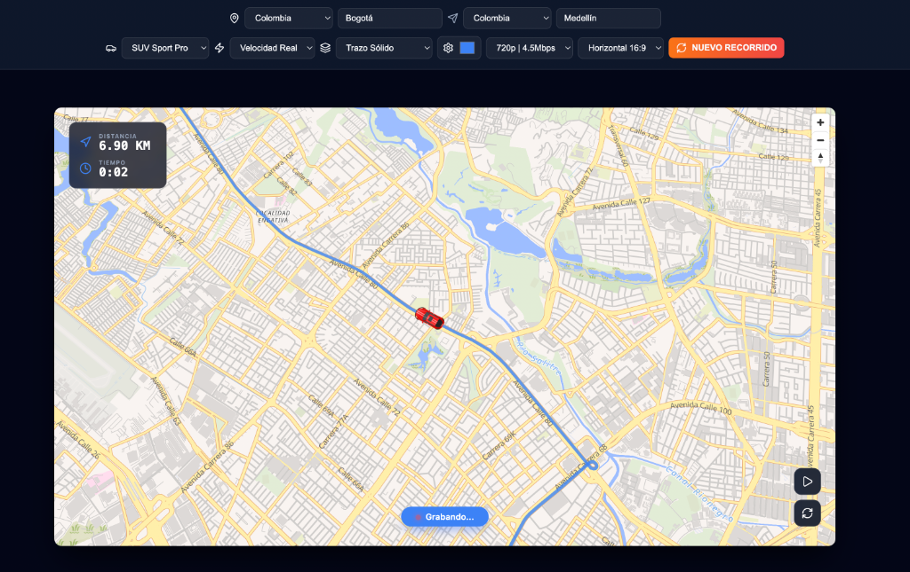

# ✈️ GeoRoute Animator React

GeoRoute Animator is a high-performance web application designed to create cinematic route animations. Perfect for travel videos, logistics demonstrations, or storytelling, it transforms simple coordinates into beautiful, animated journeys with real-time telemetry and professional aesthetics.



## 🚀 Pro Features

- **Professional Vehicle Assets**: Multi-vehicle support (SUV, Taxi, Trucks, Aircraft) in zenithal (top-down) perspective.
- **Real-Time Telemetry**: Live map overlay showing distance in Kilometers and elapsed time.
- **Aircraft Realism**: 3D elevation effects and dynamic silhouette shadows for planes.
- **High-Quality Recording**: Capture and export videos in various qualities (up to 1080p | 8Mbps) and aspect ratios (16:9, 9:16, 1:1).
- **Technical UI**: Modern dark-mode interface with "Glassmorphism" effects and professional Lucide icons.
- **Linear Precision**: Constant-speed animation logic for realistic movement feel.

## 🛠️ Usage Instructions

1. **Set Origin & Destination**: Select the country and type the city names.
2. **Choose Your Vehicle**: Select from various land vehicles or the "Airliner Pro".
3. **Configure Style**: 
   - **Speed**: Choose between "Velocidad Real" or "Timelapse".
   - **Path**: Solid, Dashed, or Dotted lines with custom colors.
   - **Quality & Format**: Pick the resolution and aspect ratio (Vertical for Shorts/TikTok, Horizontal for YouTube).
4. **Generate**: Click **"GENERAR VIDEO"**. The map will pre-load tiles and then start the recording.
5. **Instant Cancel**: Use **"NUEVO RECORRIDO"** at any time to abort the current process and start a fresh one.
6. **Download**: Una vez finalizado, haz clic en el botón verde **"DESCARGAR"**.
7. **Embed**: Haz clic en **"COMPARTIR"** para copiar automáticamente un código `<iframe>` listo para insertar en cualquier sitio web.

## 📥 Cómo Insertar (Embed) en tu Web

Tienes dos formas de integrar estos recorridos en tu sitio:

### 1. Insertar Solo el Mapa Animado (Recomendado)
Si quieres que en tu web **solo se vea el mapa y el recorrido** (sin el panel de controles), usa el parámetro `embed=true`. El botón "COMPARTIR" de la app ya genera este código automáticamente:

```html
<iframe 
  src="https://tu-app.vercel.app/?origin=Madrid&dest=Paris&v=plane&embed=true" 
  width="100%" 
  height="500" 
  frameborder="0" 
  allowfullscreen>
</iframe>
```

**Parámetros soportados:**
- `origin`: Ciudad de origen (ej. `París`).
- `dest`: Ciudad de destino (ej. `Londres`).
- `co`: Código de país origen (ej. `FR`, `ES`, `CO`).
- `cd`: Código de país destino.
- `v`: Tipo de vehículo (`plane`, `top_sport_red`, `top_taxi`, `top_truck_grey`, `top_truck_green`).
- `embed=true`: (Recomendado para webs) Oculta el panel superior y centra el mapa a pantalla completa. En este modo **no se graba video**, optimizando el rendimiento para uso interactivo.
- `speed`: Modo de velocidad (`normal` para tiempo real, `fast` para timelapse rápido).
- `color`: Color de la línea de ruta en formato Hex sin el '#' (ej. `ff5500`).
- `tel=0`: Oculta el panel de telemetría (distancia/tiempo) si prefieres un mapa 100% limpio.
- `zoom`: Nivel de zoom inicial (ej. `12`).
- `pitch`: Inclinación inicial del mapa (ej. `45`).
- `dl=1`: (Opcional) Fuerza la grabación de video en modo embed y muestra el botón de descarga al finalizar la animación.

**Ejemplo de URL avanzada:**
`https://tu-app.vercel.app/?origin=Bogota&dest=Medellin&v=top_sport_red&speed=fast&color=facc15&tel=1&zoom=8&pitch=40&embed=true`

### 2. Insertar el Video Generado (HTML5)
Si prefieres descargar el video `.webm` y alojarlo tú mismo, usa este código estándar:

```html
<video width="100%" height="auto" autoplay loop muted playsinline>
  <source src="nombre_del_video.webm" type="video/webm">
  Tu navegador no soporta videos HTML5.
</video>
```

## 📦 Instalación Local

```bash
# Install dependencies
npm install

# Run development server
npm run dev

# Build for production
npm run build
```

## 🌐 How to Deploy

To deploy this project and connect it to a repository:

### 1. Connect to GitHub/GitLab
```bash
# Initialize git repository
git init

# Add all files
git add .

# Commit changes
git commit -m "Initial commit: GeoRoute Animator PRO"

# Add your remote repository (create one on GitHub first)
git remote add origin https://github.com/your-username/georoute-animator.git

# Push to main branch
git push -u origin main
```

### 2. Live Deployment
The easiest way to deploy this Vite/React project is using **Vercel** or **Netlify**:

- **Vercel (Recommended)**:
  1. Go to [vercel.com](https://vercel.com).
  2. Import your GitHub repository.
  3. Vercel will automatically detect the Vite setup.
  4. Click **Deploy**. Your app will be live in seconds.

- **Netlify**:
  1. Drag and drop your `dist` folder (after running `npm run build`) to Netlify, or connect your repo for automatic builds.

---
*Built with React, MapLibre GL, Turf.js and Lucide Icons.*
